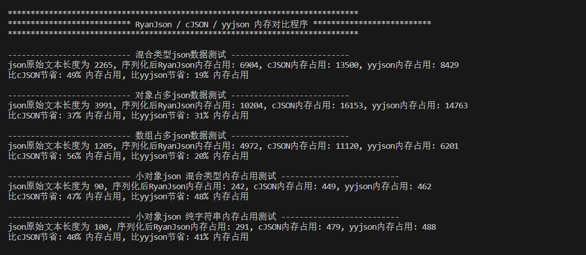
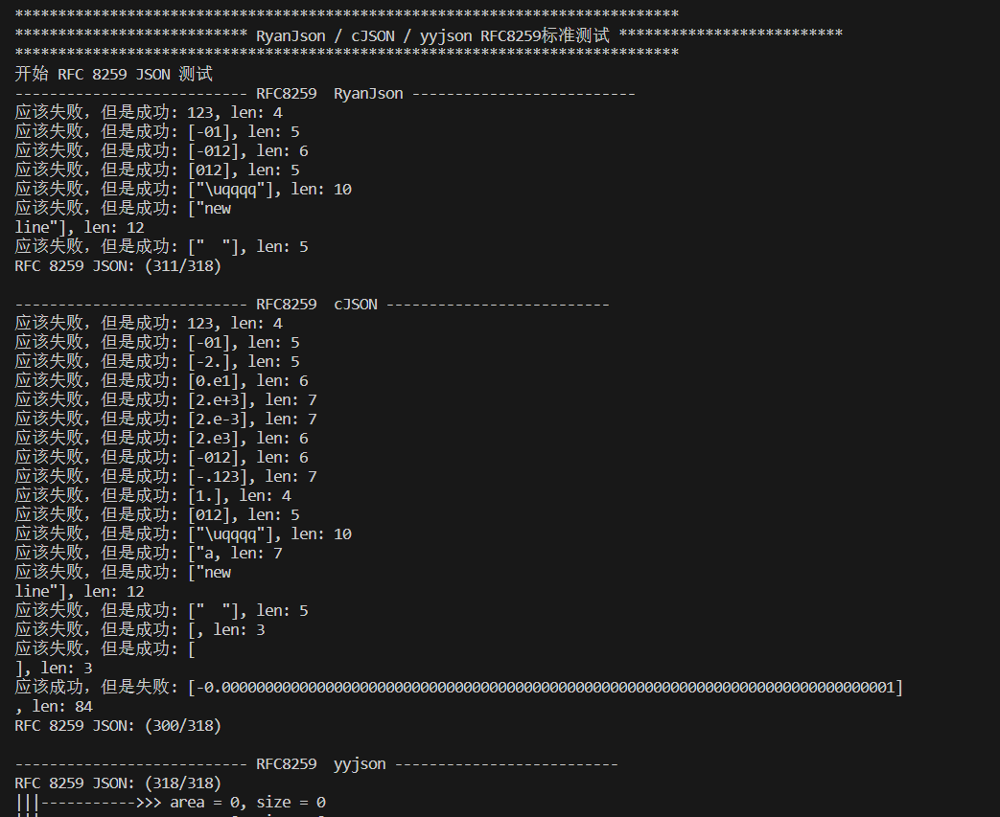

# RyanJson
***一个针对资源受限的嵌入式设备优化的Json库，内存占用极小的通用Json库，简洁高效！***

*初衷：项目进行重构json结构变复杂了很多，cJSON内存占用太高，已经满足不了需求。*

## 1、介绍

RyanJson是一个小巧的c语言json解析器，包含json文本文件解析 / 生成，**专门针对内存占用进行优化**，相比cJSON内存占用减少30% - 60%，运行速度和cJSON差不多。

- **低内存占用**：使用动态扩展技术，在32位系统下，一个基础json节点仅占用8字节。
- **开发人员友好**：仅有一个c文件和头文件轻松集成，hook函数方便自定义内存钩子。类cJSON的api，迁移成本低。
- **严格但不严苛**：符合 RFC 8295 大部分JSON标准，支持无限的json嵌套级别（需注意堆栈空间）、灵活的配置修改项
- **可扩展性**：允许注释(需调用mini函数清除注释后再解析)、尾随逗号等无效字符(parse时可配置是否允许)等

## 2、设计

**RyanJson设计时大量借鉴了 [json](https://api.gitee.com/Lamdonn/json) 和 [cJSON](https://github.com/DaveGamble/cJSON) ! 是从 [json](https://api.gitee.com/Lamdonn/json) 的基础上修改来的**

json语法是**JavaScript**对象语法的子集，可通过下面两个连接学习json语法。

[JSON规范](https://www.json.org/json-en.html)

[Parsing JSON is a Minefield 建议看看](https://seriot.ch/projects/parsing_json.html)

在json语法中，数据以键值对的形式存储（数组没有key）

在RyanJson解析器中，**使用结构体来表示一个键值对，是存储的最小单元**，结构如下：

```c
struct RyanJsonNode
{
    uint32_t info;             // 包含类型，key等标志
    struct RyanJsonNode *next; // 单链表node节点

    // [char *key] 有key的json节点, 会动态创建指针

    // 有value值的节点, 会动态创建指针
    // [int32_t value / double value / char* value / RyanJson_t item]
};

typedef struct RyanJsonNode *RyanJson_t;
```

**此结构体包含两个固定成员 info 和 next；**

**info**：为当前节点的配置信息用来表示 节点数据类型 和 flag标志位。

```
bits  low --> high
---------------------------------------------------------------------
| 0 | 1 | 2 | 3 | 4 | 5 | 6 | 7 | 8 | 9 | 10 | NA | NA | .......
---------------------------------------------------------------------
\______________________________/  |   |   |
             low 8bits            |   |   |
                |                 |   |   |
                V                 |   |   |
   RyanJsonTypeUnknow    (bit0)   |   |   |
   RyanJsonTypeNull      (bit1)   |   |   |
   RyanJsonTypeBool      (bit2)   |   |   +----> RyanJsonWithKeyFlag			(1 << 10)
   RyanJsonTypeNumber    (bit3)   |   |
   RyanJsonTypeString    (bit4)   |   +--------> RyanJsonValueNumberIntFlag		(1 << 9)
   RyanJsonTypeArray     (bit5)   |
   RyanJsonTypeObject    (bit6)   +------------> RyanJsonValueBoolTrueFlag 		(1 << 8)
   spare				 (bit7)
```

**next**：指针指向链表下一个节点

```
{
	  "name": "RyanJson",
next (
	  "version": "xxx",
next (
	  "repository": "https://github.com/Ryan-CW-Code/RyanJson",
next (
	  "keywords": ["json", "streamlined", "parser"],
next (      \__item__/  \__next__/    \__next__/
	  "others": {
		    ...
	  }
}
```

**此结构体还包括两个可能动态创建的成员 key 和 value；**

**key**：存储键值对的 key 信息，当存在key时会在申请RyanJsonNode内存时，动态添加。

**value**：存储键值对的 value 信息，会根据不同节点类型创建不同的value值。会在申请RyanJsonNode内存时，动态添加。

## 3、测试

测试代码可在本项目根目录查看。

#### 内存占用测试



#### RFC 8295 标准测试，大部分嵌入式场景不会出现复杂的特殊json结构

***RyanJson和cJSON都不适合处理复杂的UTF-16字符集，如果项目需要兼容Unicode字符集，可以考虑yyjson / json-c***



## 4、局限性

- 使用int / double表示json中的number类型，**精度有所丢失**。建议64位的number类型最好用string字符串表示。
- **对象中允许有重复的key**，RyanJson库采用单向链表，会访问到第一个对象。

## 5、文档

文档可在 [Ryan文档中心](https://ryan-cw-code.github.io/RyanDocs/)获取

## 6、联系

Email：1831931681@qq.com

wx：17513216936
